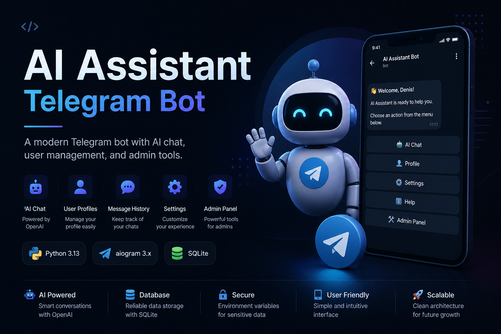
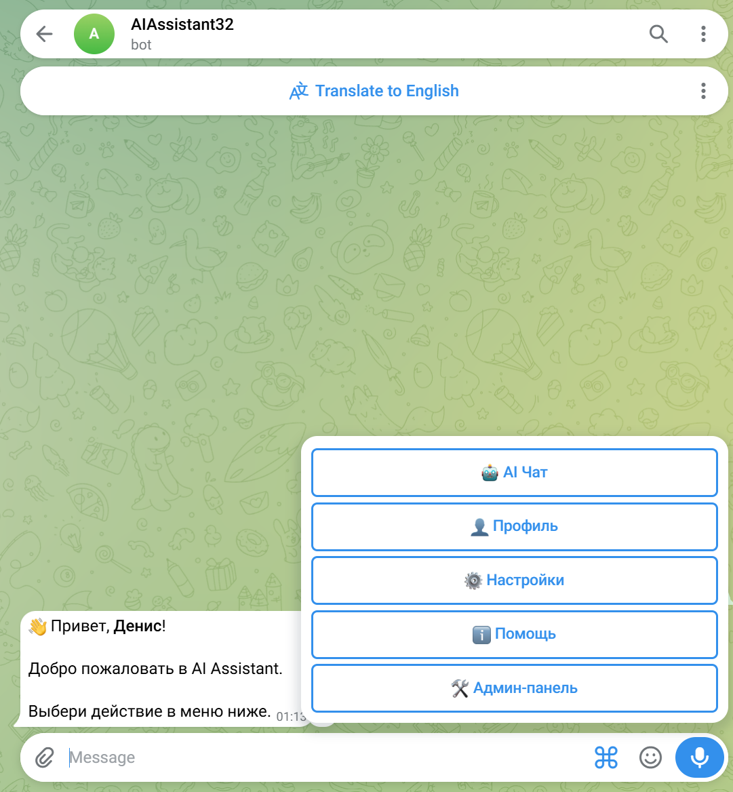

<p align="center">
  
</p>


# AI Assistant Telegram Bot

Modern Telegram AI Assistant built with **Python**, **aiogram** and **SQLite**.

Designed as a portfolio-ready project demonstrating clean architecture, service-based design and scalable Telegram bot development.

## Features

## ✨ Highlights

- 🤖 AI Chat Mode
- 👤 User Profiles
- 💬 Message History
- 🧹 Chat History Cleanup
- ⚙️ Settings System
- 🛠 Admin Panel
- 📢 Broadcast Messages
- 🗄 SQLite Database
- 🔒 Environment Variables
- 📦 Clean Architecture

## 📸 Screenshots

<p align="center">
  
</p>

## Tech Stack

- Python
- aiogram
- SQLite
- python-dotenv
- OpenAI-ready architecture

## Project Structure

```text
app/
├── database/
├── handlers/
├── keyboards/
├── llm/
├── services/
├── texts/
└── utils/
```

## Setup

```bash
python -m venv venv
```

```bash
venv\Scripts\activate.bat
```

```bash
python -m pip install -r requirements.txt
```

Create `.env` file:

```env
BOT_TOKEN=your_telegram_bot_token
ADMIN_ID=your_telegram_id
OPENAI_API_KEY=
```

Run bot:

```bash
python main.py
```

## Admin Commands

```text
/users
/broadcast Your message
```

## Notes

OpenAI integration is prepared in the architecture.  
By default, the bot uses a test AI response until an API key and billing are configured.
